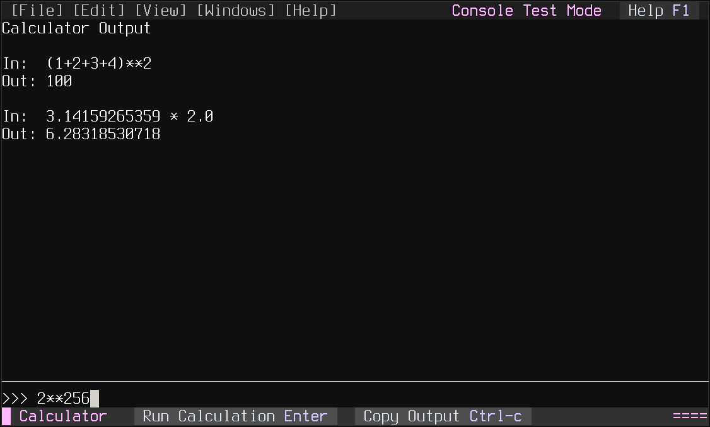
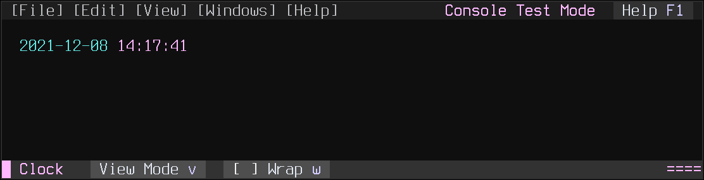
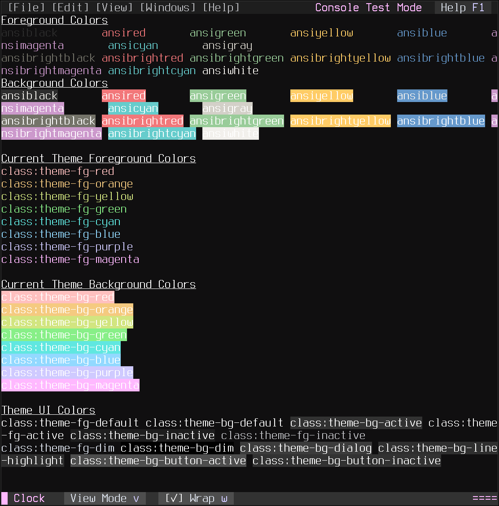

.. _module-pw_console-plugins:

============
Plugin Guide
============
Pigweed Console supports extending the user interface with custom widgets. For
example: Toolbars that display device information and provide buttons for
interacting with the device.

---------------
Writing Plugins
---------------
Creating new plugins has a few high level steps:

1. Create a new Python class inheriting from either `WindowPane`_ or
   `WindowPaneToolbar`_.

   - Optionally inherit from The ``PluginMixin`` class as well for running
     background tasks.

2. Enable the plugin before pw_console startup by calling ``add_window_plugin``,
   ``add_top_toolbar`` or ``add_bottom_toolbar``. See the
   :ref:`module-pw_console-embedding-plugins` section of the
   :ref:`module-pw_console-embedding` for an example.

3. Run the console and enjoy!

   - Debugging Plugin behavior can be done by logging to a dedicated Python
     logger and viewing in-app. See `Debugging Plugin Behavior`_ below.

Background Tasks
================
Plugins may need to have long running background tasks which could block or slow
down the Pigweed Console user interface. For those situations use the
``PluginMixin`` class. Plugins can inherit from this and setup the callback that
should be executed in the background.

.. autoclass:: pw_console.plugin_mixin.PluginMixin
    :members:
    :show-inheritance:

Debugging Plugin Behavior
=========================
If your plugin uses background threads for updating it can be difficult to see
errors. Often, nothing will appear to be happening and exceptions may not be
visible. When using ``PluginMixin`` you can specify a name for a Python logger
to use with the ``plugin_logger_name`` keyword argument.

.. code-block:: python

   class AwesomeToolbar(WindowPaneToolbar, PluginMixin):

       def __init__(self, *args, **kwargs):
           super().__init__(*args, **kwargs)
           self.update_count = 0

           self.plugin_init(
               plugin_callback=self._background_task,
               plugin_callback_frequency=1.0,
               plugin_logger_name='my_awesome_plugin',
           )

       def _background_task(self) -> bool:
           self.update_count += 1
           self.plugin_logger.debug('background_task_update_count: %s',
                                    self.update_count)
           return True

This will let you open up a new log window while the console is running to see
what the plugin is doing. Open up the logger name provided above by clicking in
the main menu: :guilabel:`File > Open Logger > my_awesome_plugin`.

--------------
Sample Plugins
--------------
Pigweed Console will provide a few sample plugins to serve as templates for
creating your own plugins. These are a work in progress at the moment and not
available at this time.

Calculator
==========
This plugin is similar to the full-screen `calculator.py example`_ provided in
prompt_toolkit. It's a full window that can be moved around the user interface
like other Pigweed Console window panes. An input prompt is displayed on the
bottom of the window where the user can type in some math equation. When the
enter key is pressed the input is processed and the result shown in the top half
of the window.

Both input and output fields are prompt_toolkit `TextArea`_ objects which can
have their own options like syntax highlighting.

  Screenshot of the ``CalcPane`` plugin showing some math calculations.

The code is heavily commented and describes what each line is doing. See
the :ref:`calc_pane_code` for the full source.

Clock
=====
The ClockPane is another WindowPane based plugin that displays a clock and some
formatted text examples. It inherits from both WindowPane and PluginMixin.

  ``ClockPane`` plugin screenshot showing the clock text.

This plugin makes use of PluginMixin to run a task a background thread that
triggers UI re-draws. There are also two toolbar buttons to toggle view mode
(between the clock and some sample text) and line wrapping. pressing the
:kbd:`v` key or mouse clicking on the :guilabel:`View Mode` button will toggle
the view to show some formatted text samples:

  ``ClockPane`` plugin screenshot showing formatted text examples.

Like the CalcPane example the code is heavily commented to guide plugin authors
through developmenp. See the :ref:`clock_pane_code` below for the full source.

--------
Appendix
--------
.. _calc_pane_code:

Code Listing: ``calc_pane.py``
==============================
.. literalinclude:: ./py/pw_console/plugins/calc_pane.py
   :language: python
   :linenos:

.. _clock_pane_code:

Code Listing: ``clock_pane.py``
===============================
.. literalinclude:: ./py/pw_console/plugins/clock_pane.py
   :language: python
   :linenos:

.. _WindowPane: https://cs.opensource.google/pigweed/pigweed/+/main:pw_console/py/pw_console/widgets/window_pane.py
.. _WindowPaneToolbar: https://cs.opensource.google/pigweed/pigweed/+/main:pw_console/py/pw_console/widgets/window_pane_toolbar.py
.. _calculator.py example: https://github.com/prompt-toolkit/python-prompt-toolkit/blob/3.0.23/examples/full-screen/calculator.py
.. _TextArea: https://python-prompt-toolkit.readthedocs.io/en/latest/pages/reference.html#prompt_toolkit.widgets.TextArea
