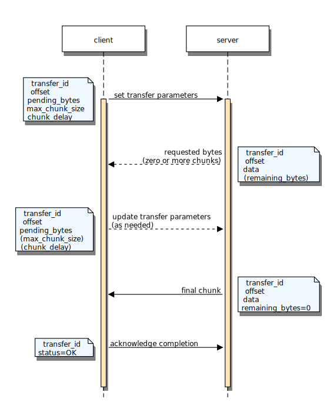
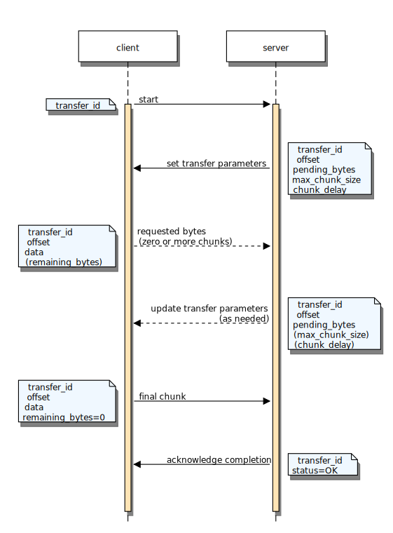

.. _module-pw_transfer:

===========
pw_transfer
===========

.. attention::

  ``pw_transfer`` is under construction and so is its documentation.

-----
Usage
-----

C++
===
The transfer service is defined and registered with an RPC server like any other
RPC service.

To know how to read data from or write data to device, a ``TransferHandler``
interface is defined (``pw_transfer/public/pw_transfer/handler.h``). Transfer
handlers wrap a stream reader and/or writer with initialization and completion
code. Custom transfer handler implementations should derive from
``ReadOnlyHandler``, ``WriteOnlyHandler``, or ``ReadWriteHandler`` as
appropriate and override Prepare and Finalize methods if necessary.

A transfer handler should be implemented and instantiated for each unique data
transfer to or from a device. These handlers are then registered with the
transfer service using their transfer IDs.

**Example**

.. code-block:: cpp

  #include "pw_transfer/transfer.h"

  namespace {

  // Simple transfer handler which reads data from an in-memory buffer.
  class SimpleBufferReadHandler : public pw::transfer::ReadOnlyHandler {
   public:
    SimpleReadTransfer(uint32_t transfer_id, pw::ConstByteSpan data)
        : ReadOnlyHandler(transfer_id), reader_(data) {
      set_reader(reader_);
    }

   private:
    pw::stream::MemoryReader reader_;
  };

  // The maximum amount of data that can be sent in a single chunk, excluding
  // transport layer overhead.
  constexpr size_t kMaxChunkSizeBytes = 256;

  // In a write transfer, the maximum number of bytes to receive at one time,
  // (potentially across multiple chunks), unless specified otherwise by the
  // transfer handler's stream::Writer.
  constexpr size_t kDefaultMaxBytesToReceive = 1024;

  // Instantiate a static transfer service.
  // The service requires a work queue, and a buffer to store data from a chunk.
  // The helper class TransferServiceBuffer comes with a builtin buffer.
  pw::transfer::TransferServiceBuffer<kMaxChunkSizeBytes> transfer_service(
      GetSystemWorkQueue(), kDefaultMaxBytesToReceive);

  // Instantiate a handler for the data to be transferred.
  constexpr uint32_t kBufferTransferId = 1;
  char buffer_to_transfer[256] = { /* ... */ };
  SimpleBufferReadHandler buffer_handler(kBufferTransferId, buffer_to_transfer);

  }  // namespace

  void InitTransfer() {
    // Register the handler with the transfer service, then the transfer service
    // with an RPC server.
    transfer_service.RegisterHandler(buffer_handler);
    GetSystemRpcServer().RegisterService(transfer_service);
  }

Module Configuration Options
----------------------------
The following configurations can be adjusted via compile-time configuration of
this module, see the
:ref:`module documentation <module-structure-compile-time-configuration>` for
more details.

.. c:macro:: PW_TRANSFER_DEFAULT_MAX_RETRIES

  The default maximum number of times a transfer should retry sending a chunk
  when no response is received. This can later be configured per-transfer.

.. c:macro:: PW_TRANSFER_DEFAULT_TIMEOUT_MS

  The default amount of time, in milliseconds, to wait for a chunk to arrive
  before retrying. This can later be configured per-transfer.

.. c:macro:: PW_TRANSFER_DEFAULT_EXTEND_WINDOW_DIVISOR

  The fractional position within a window at which a receive transfer should
  extend its window size to minimize the amount of time the transmitter
  spends blocked.

  For example, a divisor of 2 will extend the window when half of the
  requested data has been received, a divisor of three will extend at a third
  of the window, and so on.

Python
======
.. automodule:: pw_transfer
  :members: ProgressStats, Manager, Error

**Example**

.. code-block:: python

  import pw_transfer

  # Initialize a Pigweed RPC client; see pw_rpc docs for more info.
  rpc_client = CustomRpcClient()
  rpcs = rpc_client.channel(1).rpcs

  transfer_service = rpcs.pw.transfer.Transfer
  transfer_manager = pw_transfer.Manager(transfer_service)

  try:
    # Read transfer_id 3 from the server.
    data = transfer_manager.read(3)
  except pw_transfer.Error as err:
    print('Failed to read:', err.status)

  try:
    # Send some data to the server. The transfer manager does not have to be
    # reinitialized.
    transfer_manager.write(2, b'hello, world')
  except pw_transfer.Error as err:
    print('Failed to write:', err.status)

Typescript
==========

Provides a simple interface for transferring bulk data over pw_rpc.

**Example**

.. code-block:: typescript

    import {Manager} from '@pigweed/pw_transfer'

    const client = new CustomRpcClient();
    service = client.channel()!.service('pw.transfer.Transfer')!;

    const manager = new Manager(service, DEFAULT_TIMEOUT_S);

    manager.read(3, (stats: ProgressStats) => {
      console.log(`Progress Update: ${stats}`);
    }).then((data: Uint8Array) => {
      console.log(`Completed read: ${data}`);
    }).catch(error => {
      console.log(`Failed to read: ${error.status}`);
    });

    manager.write(2, textEncoder.encode('hello world'))
      .catch(error => {
        console.log(`Failed to read: ${error.status}`);
      });

--------
Protocol
--------

Protocol buffer definition
==========================
.. literalinclude:: transfer.proto
  :language: protobuf
  :lines: 14-

Server to client transfer (read)
================================

Client to server transfer (write)
=================================

Errors
======

Protocol errors
---------------
At any point, either the client or server may terminate the transfer with a
status code. The transfer chunk with the status is the final chunk of the
transfer.

The following table describes the meaning of each status code when sent by the
sender or the receiver (see `Transfer roles`_).

.. cpp:namespace-push:: pw::stream

+-------------------------+-------------------------+-------------------------+
| Status                  | Sent by sender          | Sent by receiver        |
+=========================+=========================+=========================+
| ``OK``                  | (not sent)              | All data was received   |
|                         |                         | and handled             |
|                         |                         | successfully.           |
+-------------------------+-------------------------+-------------------------+
| ``ABORTED``             | The service aborted the transfer because the      |
|                         | client restarted it. This status is passed to the |
|                         | transfer handler, but not sent to the client      |
|                         | because it restarted the transfer.                |
+-------------------------+---------------------------------------------------+
| ``CANCELLED``           | The client cancelled the transfer.                |
+-------------------------+-------------------------+-------------------------+
| ``DATA_LOSS``           | Failed to read the data | Failed to write the     |
|                         | to send. The            | received data. The      |
|                         | :cpp:class:`Reader`     | :cpp:class:`Writer`     |
|                         | returned an error.      | returned an error.      |
+-------------------------+-------------------------+-------------------------+
| ``FAILED_PRECONDITION`` | Received chunk for transfer that is not active.   |
+-------------------------+-------------------------+-------------------------+
| ``INVALID_ARGUMENT``    | Received a malformed packet.                      |
+-------------------------+-------------------------+-------------------------+
| ``INTERNAL``            | An assumption of the protocol was violated.       |
|                         | Encountering ``INTERNAL`` indicates that there is |
|                         | a bug in the service or client implementation.    |
+-------------------------+-------------------------+-------------------------+
| ``PERMISSION_DENIED``   | The transfer does not support the requested       |
|                         | operation (either reading or writing).            |
+-------------------------+-------------------------+-------------------------+
| ``RESOURCE_EXHAUSTED``  | The receiver requested  | Storage is full.        |
|                         | zero bytes, indicating  |                         |
|                         | their storage is full,  |                         |
|                         | but there is still data |                         |
|                         | to send.                |                         |
+-------------------------+-------------------------+-------------------------+
| ``UNAVAILABLE``         | The service is busy with other transfers and      |
|                         | cannot begin a new transfer at this time.         |
+-------------------------+-------------------------+-------------------------+
| ``UNIMPLEMENTED``       | Out-of-order chunk was  | (not sent)              |
|                         | requested, but seeking  |                         |
|                         | is not supported.       |                         |
+-------------------------+-------------------------+-------------------------+

.. cpp:namespace-pop::

Client errors
-------------
``pw_transfer`` clients may immediately return certain errors if they cannot
start a transfer.

.. list-table::

  * - **Status**
    - **Reason**
  * - ``ALREADY_EXISTS``
    - A transfer with the requested ID is already pending on this client.
  * - ``DATA_LOSS``
    - Sending the initial transfer chunk failed.
  * - ``RESOURCE_EXHAUSTED``
    - The client has insufficient resources to start an additional transfer at
      this time.

Transfer roles
==============
Every transfer has two participants: the sender and the receiver. The sender
transmits data to the receiver. The receiver controls how the data is
transferred and sends the final status when the transfer is complete.

In read transfers, the client is the receiver and the service is the sender. In
write transfers, the client is the sender and the service is the receiver.

Sender flow
-----------
.. mermaid::

  graph TD
    start([Client initiates transfer]) -->data_request
    data_request[Receive transfer parameters]-->send_chunk

    send_chunk[Send chunk]-->sent_all

    sent_all{Sent final chunk?} -->|yes|wait
    sent_all-->|no|sent_requested

    sent_requested{Sent all pending?}-->|yes|data_request
    sent_requested-->|no|send_chunk

    wait[Wait for receiver]-->is_done

    is_done{Received final chunk?}-->|yes|done
    is_done-->|no|data_request

    done([Transfer complete])

Receiver flow
-------------
.. mermaid::

  graph TD
    start([Client initiates transfer]) -->request_bytes
    request_bytes[Set transfer parameters]-->wait

    wait[Wait for chunk]-->received_chunk

    received_chunk{Received chunk by deadline?}-->|no|request_bytes
    received_chunk-->|yes|check_chunk

    check_chunk{Correct offset?} -->|yes|process_chunk
    check_chunk --> |no|request_bytes

    process_chunk[Process chunk]-->final_chunk

    final_chunk{Final chunk?}-->|yes|signal_completion
    final_chunk{Final chunk?}-->|no|received_requested

    received_requested{Received all pending?}-->|yes|request_bytes
    received_requested-->|no|wait

    signal_completion[Signal completion]-->done

    done([Transfer complete])
